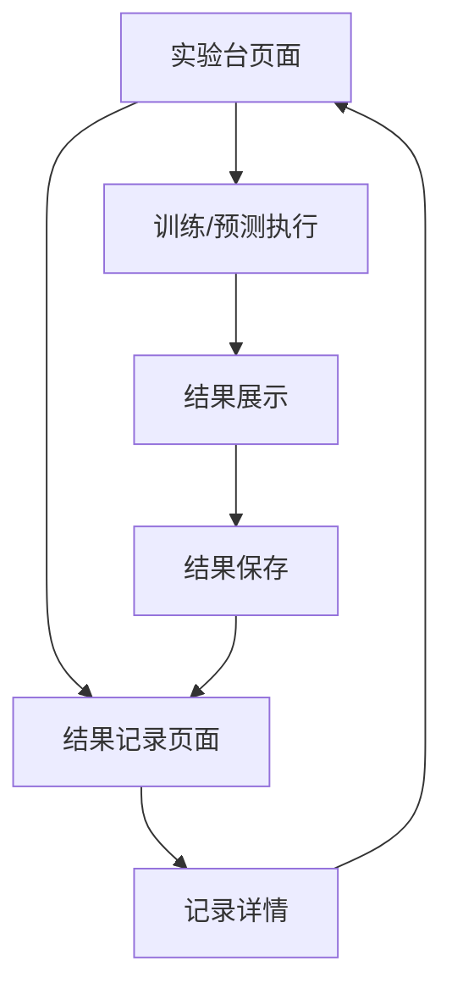

## 1. Product Overview
将现有项目推倒重建为“星体分类可视化实验台”：仅提供高斯朴素贝叶斯（Gaussian Naive Bayes）训练/预测与可视化。
新增 FastAPI 后端与 PostgreSQL 持久化每次实验结果，前端统一设计风格并确保端到端可用。

## 2. Core Features

### 2.1 Feature Module
本产品由以下页面组成：
1. **实验台页面**：数据导入、特征与目标选择、GNB参数配置、训练/预测执行、结果可视化、结果保存。
2. **结果记录页面**：结果列表查询、结果详情查看、基础对比与复现入口。

### 2.2 Page Details
| Page Name | Module Name | Feature description |
|-----------|-------------|---------------------|
| 实验台页面 | 顶部导航 | 显示产品名称与导航入口（实验台/结果记录）。 |
| 实验台页面 | 数据导入 | 上传数据文件（如CSV）；解析并展示字段预览与行数/缺失值概览。 |
| 实验台页面 | 特征与目标配置 | 选择目标列（label）与特征列；进行最小必要校验（不能为空、类型提示）。 |
| 实验台页面 | 模型配置（仅GNB） | 配置高斯朴素贝叶斯必要参数（例如 var_smoothing）；明确“已移除逻辑回归”不再出现相关UI。 |
| 实验台页面 | 训练/预测执行 | 发起后端计算：数据划分（如训练/测试比例）、训练、预测；在执行中展示进度与错误信息。 |
| 实验台页面 | 结果展示 | 展示核心指标（Accuracy/Precision/Recall/F1）、混淆矩阵、预测分布；支持下载结果摘要（JSON/CSV二选一即可）。 |
| 实验台页面 | 结果保存 | 将本次实验输入摘要（数据集名/字段选择/参数）与输出（指标/矩阵等）保存到后端数据库；保存成功给出可跳转的记录入口。 |
| 结果记录页面 | 记录列表 | 分页/按时间倒序展示实验记录（时间、数据集名、目标列、核心指标）；支持按数据集名关键字筛选。 |
| 结果记录页面 | 记录详情 | 查看单条记录的完整配置与可视化（指标+混淆矩阵）；提供“一键加载到实验台（复现配置）”入口。 |

## 3. Core Process
- 你的主要流程：进入实验台 → 上传数据 → 选择目标列与特征列 → 配置GNB参数 → 点击训练/预测 → 查看指标与图表 → 点击保存 → 在结果记录页查看与复现。
- 异常流程：上传文件格式不支持/字段缺失 → 前端提示并阻止提交；后端训练失败/数据类型不合法 → 返回可读错误并在实验台展示。

