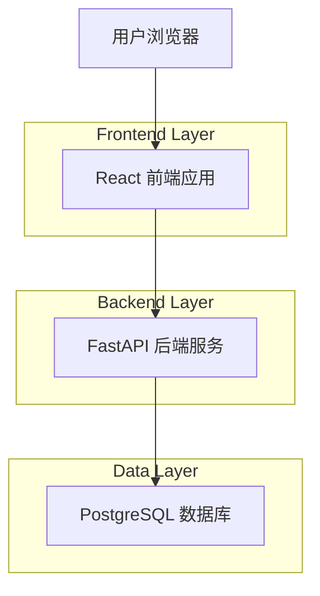
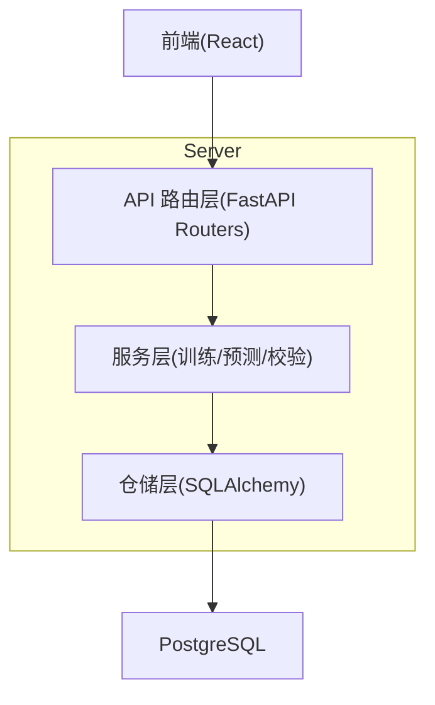
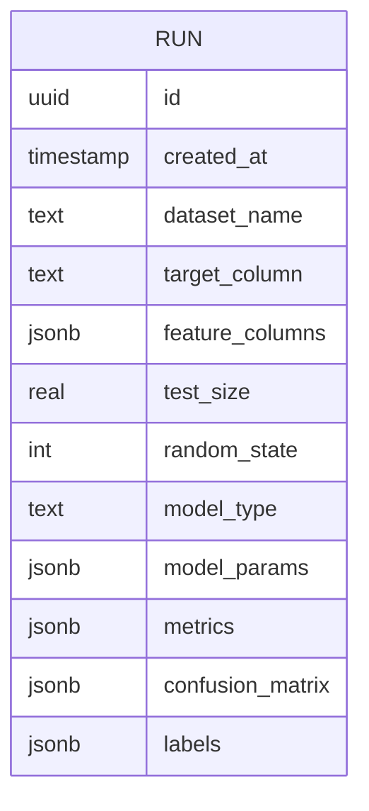

## 1.Architecture design


## 2.Technology Description
- Frontend: React@18 + TypeScript + vite + tailwindcss@3（统一视觉与组件规范）
- Backend: Python + FastAPI（REST API，承载训练/预测与结果存储）
- ML: scikit-learn（仅 GaussianNB；删除 LogisticRegression 相关逻辑与依赖引用）
- Database: PostgreSQL（结构化存储实验记录与结果）

## 3.Route definitions
| Route | Purpose |
|-------|---------|
| / | 实验台：上传数据、配置GNB、执行训练/预测、展示并保存结果 |
| /runs | 结果记录：列表、筛选、查看详情、复现实验配置 |

## 4.API definitions
### 4.1 Core Types（TypeScript）
```ts
export type ModelType = "gaussian_nb";

export type RunCreateRequest = {
  datasetName: string;
  targetColumn: string;
  featureColumns: string[];
  testSize: number; // 0~1
  randomState?: number;
  modelType: ModelType; // 固定为 gaussian_nb
  gnbParams: {
    varSmoothing?: number;
  };
  // 数据内容：可用 multipart 上传文件；此处仅定义元信息
};

export type Metrics = {
  accuracy: number;
  precision: number;
  recall: number;
  f1: number;
};

export type RunResult = {
  id: string;
  createdAt: string;
  request: RunCreateRequest;
  metrics: Metrics;
  confusionMatrix: number[][];
  labels: string[];
  notes?: string;
};
```

### 4.2 REST Endpoints
- 训练/预测并保存（推荐一体化以保证“结果落库”一致性）
```
POST /api/runs
Content-Type: multipart/form-data
```
表单字段（示例）：
- file: 数据文件（CSV）
- payload: JSON（RunCreateRequest）

响应：RunResult

- 获取记录列表
```
GET /api/runs?query=&page=&pageSize=
```
响应：`{ items: RunResult[]; total: number }`

- 获取记录详情
```
GET /api/runs/{id}
```
响应：RunResult

## 5.Server architecture diagram


## 6.Data model(if applicable)
### 6.1 Data model definition


### 6.2 Data Definition Language
Run Table (runs)
```
CREATE TABLE runs (
  id UUID PRIMARY KEY DEFAULT gen_random_uuid(),
  created_at TIMESTAMPTZ NOT NULL DEFAULT NOW(),
  dataset_name TEXT NOT NULL,
  target_column TEXT NOT NULL,
  feature_columns JSONB NOT NULL,
  test_size REAL NOT NULL,
  random_state INTEGER,
  model_type TEXT NOT NULL CHECK (model_type IN ('gaussian_nb')),
  model_params JSONB NOT NULL,
  metrics JSONB NOT NULL,
  confusion_matrix JSONB NOT NULL,
  labels JSONB NOT NULL
);

CREATE INDEX idx_runs_created_at ON runs (created_at DESC);
CREATE INDEX idx_runs_dataset_name ON runs (dataset_name);
```
